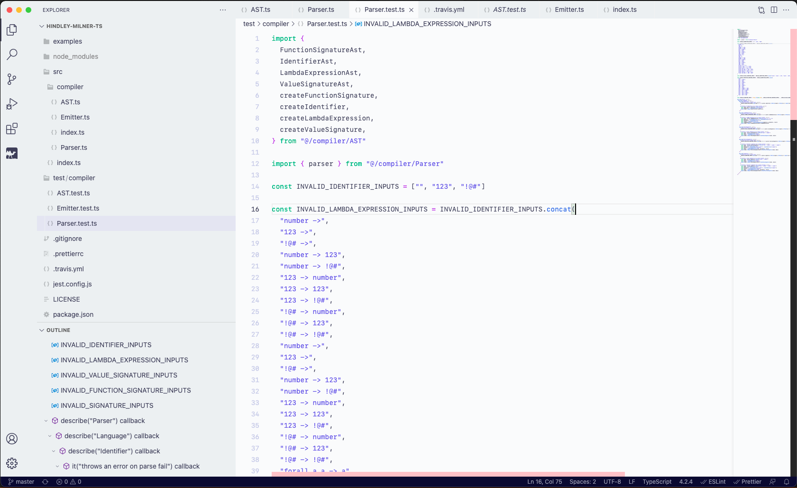

# Rescript Light Theme

A minimalist reproduction of the theme used throughout Rescript's documentation. 🤍



## Installation

Install the extension through the visual studio code marketplace.

## Extra goodies

For that perfect look and feel:

```
{
    "editor.fontFamily": "SF Mono",
    "editor.fontSize": 14,
    "editor.lineHeight": 24
}
```

You can also go a step further and install "Customize UI" to make your editor's UI even sexier.

## Contributing

Is your favourite language's syntax not highlighting correctly?

Feel free to open a PR or an issue.
